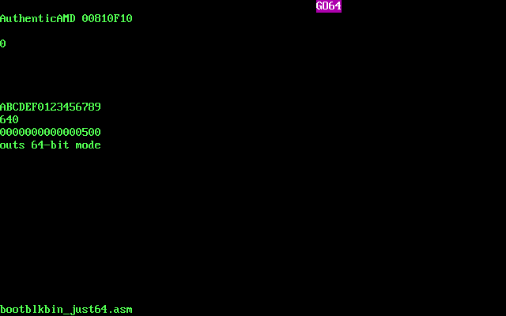
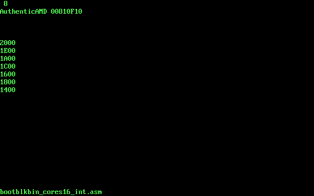
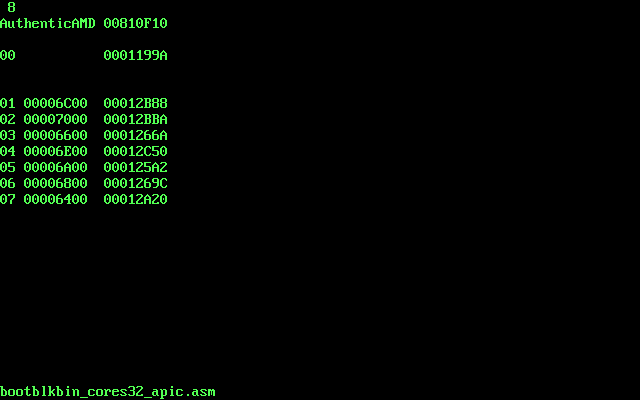
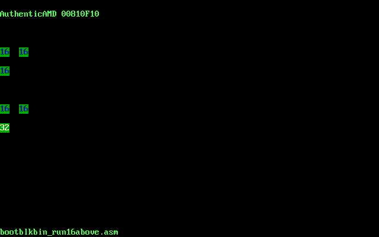

# Boot block &eacute;tudes 

## What is this? 

512 byte PC boot block assembly examples for bare metal programming joy, exploring Intel/AMD CPU features and internal operation. 

- basic CPU operation tests (descriptors, D-bit, B-bit, limit)
- 32-bit mode
- 286/386 protected mode switch
- IDT interrupts
- APIC interrupts
- multicore wake-up
- 16-bit Real Mode exceptions and 8086 emulation
- 64-bit mode switch
- mixing 16/32/64-bit code
- some frame buffer graphics with VESA call setup

Ongoing process.. with low threshold to make it public as it is. 

What is not here: TSS, hardware task switch, caching, privilege levels, call gates, paging (well, 64-bit mode needs paging). 

## It works on my hardware 

Absolutely no guarantee that these examples work everywhere. The BIOS leaves the CPU and hardware in a certain, but quite standard state. Mostly. The 16-bit Real Mode. Code is written minimal so that it works on Hyper-V first, the fastest way to boot, then test Virtual Box, then a few real hardware. If there is an issue, try fixing it. If it works it works. 

## NASM assembler

Code written for and assembled with NASM assembler. 

	>nasm -v
	NASM version 2.14.02 compiled on Dec 26 2018

Plain binary output ORG = 7C00. 

F. ex. `nasm bootblkbin_int64.asm -fbin -obin.vfd -lbootblkbin.l`

NASM will create a bootable virtual floppy file, `bin.vfd`, ready to boot in VM-s or the same file with PXE boot on real hardware. 

### bin.vfd 

360K (smallest possible) .vfd file that Hyper-V accepts. Virtual Box, PXE is happy with 512 byte file size. Boot block parameters, ROM signature not even needed for any VMs, we have the whole 512 bytes available for code. PXE boot is the same. Note that PXE loads the whole boot file at 7C00, not only one "sector". There are no sectors in PXE. 

## Running on VM-s: floppy boot

I use Hyper-V and Virtual Box 6.1 mostly on my AMD Ryzen Win10 host PC (good to test AMD features). Hyper-V is super fast to boot from virtual floppy. The guest OS is simple with all extra stuff disabled and with some 32MB RAM. No HDD. Attach bin.vfd as floppy and boot. 

How exactly the hardware is virtualized may also vary (eg. on startup A20 is inhibited on Virtual Box 6.1, but not on Hyper-V; segment limits are already extended on Hyper-V but not on VBox etc.). 

## Running on real hardware: PXE boot

Most of the examples are tested on some of my old rigs and notebooks I have: a Core i7 Haswell box, a Core i3 NUC SoC, an older Core 2 Duo notebook etc.
 
If BIOS can do network boot the PC is ready to go. Boot with PXE. I use the excellent `tftpd64.452`, where the same bin.vfd is the boot file for DHCP. A little pain to set up this program. Needs only DHCP and TFTP server to work correctly.
 
I abandoned writing physical floppies and boot another PC long ago..

----------------

# Bootblk files - incomplete and not in a particular order

## 64-bit mode

I always wondered.. what 64-bit mode is, how it is working, is there any benefit for bare metal and how to switch the CPU into 64-bit mode. Because the whole point is to address more than 4GB continuous memory, every effective address calculation is 64-bit. Therefore every registers, pointers in system strucures are 64-bit.. and so on. Tough topic. I think AMD made a wonderful job. 64-bit mode on top of a 32-bit processor is likely genuine as the 386 was build around 1985 by Intel on top of the 16-bit 8086: not a distinct mode but the CPU is both a 32- and 16-bit processor at the same time. 

### bootblkbin_just64.asm

[bootblkbin_just64.asm](ASM/bootblkbin_just64.asm)

Switch to 64-bit mode and execute a few 64-bit instructions in `[BITS 64]`. 

- It requires paging tables, directories and CR3 set up
- CR0.PG to set
- Enable CR4.PAE page address extensions
- Enable Long Mode bit in MSR EFER 0xC0000080
- Only in protected mode CR0.PE=1
- then transfer to 64-bit code L=1

What I did - for bare metal - is to linear map the lower 4GB of memory with page tables, just to use the CPU, hardware and memory as it is in 32-bit mode. See [inc.EnableLongModePML4E16.asm](ASM/inc.EnableLongModePML4E16.asm).  

## Multi-core 

Attepts to start other processor cores and do some tests. Local APIC programming. First just run AP code in RM. Then switch AP-s to 32-bit protected mode, use IDT-style interrupts, test APIC Timer. 

### bootblkbin_cores16.asm

[bootblkbin_cores16.asm](ASM/bootblkbin_cores16.asm)

### bootblkbin_cores32_apic.asm

[bootblkbin_cores32_apic.asm](ASM/bootblkbin_cores32_apic.asm)

## 16-bit fiddling

### bootblkbin_run16above.asm

[bootblkbin_run16above.asm](ASM/bootblkbin_run16above.asm)

I was wondering how to execute D=0 16-bit code way above 1MB high in memory. CPU always uses full EIP for code fetch so this should work. CS segment limit should be extended first. Because of 8086-emulation, every jump, call, ret should use 32-bit operand size to work (otherwise EIP HI zeroed). Interestingly, CPU even honors the 66h prefix for short jump and works correctly in high memory. 

## VESA Linear Frame Buffer graphics

Good ol' VESA VBE graphics modes are still supported in many PC BIOS - including Hyper-V and Virtual Box. It's fairly easy to get some Direct Color mode with Linear Frame Buffer. INT 10 then using 32/64-bit code to write and manipulate pixels. My favourites for testing are 16-bpp modes, 2 bytes per pixel, standard like 640x480, 800x600 or 1024x768. No space for VBE queries here, error handling, just set mode right away - and hope for the best. 

